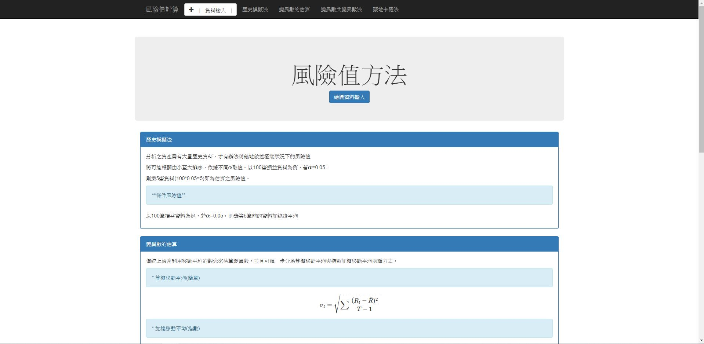

# 主旨

將之前寫的風險值計算，用C#重寫一遍，作為練習

[Python風險值計算](https://nbviewer.jupyter.org/github/ZhongIan/RE_Project/blob/master/%E9%A2%A8%E9%9A%AA%E5%80%BC/F_RE.ipynb)


先將股價資料匯入MSSQL，再透過C#取資料，

用Boostrap建構前端，再用JQuery控制行為，

使用AJAX向後端溝通，傳輸資料，

繪圖是透過plotly的js套件完成。

# 內容

**網頁內容**

<div align=center></div>

點選上方黑色Nav中的資料輸入，或者點選Buttun繪圖資料輸入，則跑出Modal

**Modal**

<div align=center></div>

選擇資料後按下送出，則在指定方法下繪圖，並滾動至此方法

**繪圖**

<div align=center></div>

# 資料傳輸

MSSQL -> DataFromSql.cs -> method.cs -> JSON.aspx.cs -> MAIN.aspx

* DataFromSql.cs 向MSSQL取資料

* method.cs 做風險值計算

* JSON.aspx.cs 序列化資料

*  MAIN.aspx 前端顯示

## DataFromSql.cs

透過[DataFromSql.cs](./App_Code\/DataFromSql.cs)的自訂函數，向MSSQL取資料，

由於有3檔故價資訊，所以構造一個預存程序，以做練習

```sql
create proc 風險值運算資料
    @s_name varchar(12) = '1201'
as
begin

    exec('select [date], [return] from' + '[' + @s_name + ']')

end
```

有時間和報酬(return)兩個屬性

```C#
// 屬性 時間和報酬(return)序列
// 只寫 get 表只能讀
public List<string> Date_list
{
    get { return date_list; }
}

public List<double> Return_list
{
    get { return return_list; }
}
```

## method.cs

透過[method.cs](./App_Code\/method.cs)傳入以下4個參數進行風險值的計算

```C#
public Method(
string stock_name="1201", // 股票代號
double alpha=0.05, // alpha值
string sigma_method ="簡單(Sample)",  // 變異數方法
string method_fun= "Cm" // 風險值計算方法
)
```

有以下4個屬性

```C#
// 屬性 透過JSON.asp序列化傳給前端
public string[] Date { get; set; } // 時間
public double[] Rt { get; set; } // 報酬(return)
public double[] Rv { get; set; } // 風險值
public double[] RCv { get; set; } // 條件風險值
```

## JSON.aspx.cs

參考[這篇](https://dotblogs.com.tw/hatelove/2011/11/22/jquery-ajax-aspx-json)做AJAX資料處理

透過前端回傳的資料

```C#
string stock = Request.Form["stock"];
double alpha = Convert.ToDouble(Request.Form["alpha"]);
string sigma = Request.Form["sigma"];
string method_fun = Request.Form["method"];
```

來 new 一個 Method 類

```C#
var responseEntities = new List<Method>()
{
    new Method(stock_name:stock,alpha:alpha, method_fun:method_fun)
        
};
var result = serializer.Serialize(responseEntities);
Response.Write(result);
```

輸出資料如下

```js
[
    {
        "Date":[...],
        "Rt":[...],
        "Rv":[...],
        "RCv":[...]
    }
]
```

## MAIN.aspx

透過Jquery解析JSON.asp回傳資料，並藉由Plotly(js套件)繪圖

```js
function Result_Plot(data,divID) {
    //alert("Ajax!!"); //測試用
    var JS_data = $.parseJSON(data)[0];
    var trace_return = {
        x: JS_data["Date"],
        y: JS_data["Rt"],
        mode: 'lines',
        name: 'return',
        type: 'scatter'
    };
    var trace_VaR = {
        x: JS_data["Date"],
        y: JS_data["Rv"],
        mode: 'lines',
        name: 'VaR',
        type: 'scatter'
    };
    var trace_CVaR = {
        x: JS_data["Date"],
        y: JS_data["RCv"],
        mode: 'lines',
        name: 'CVaR',
        type: 'scatter'
    };
    var Ply_data = [trace_return, trace_VaR, trace_CVaR];
    Plotly.newPlot("plot"+divID, Ply_data);
}
```

並透過Jquery滾動至指定位置

```js
//由於Nav佔有空間 需往下90
function FunScroll(idname) {
    event.preventDefault();
    var top = $('#'+idname).offset().top - 90;
    $('html,body').animate({scrollTop:top},800);
}
```
